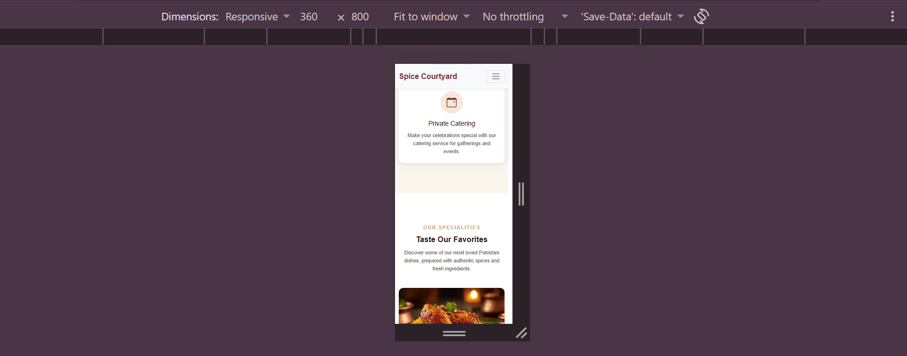
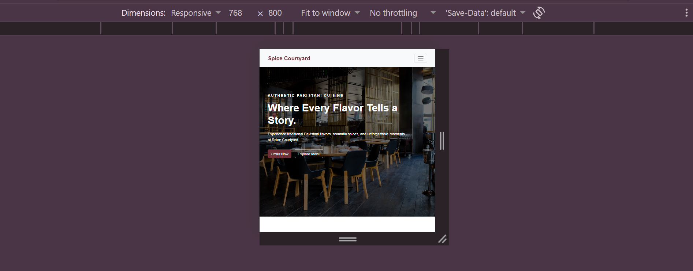
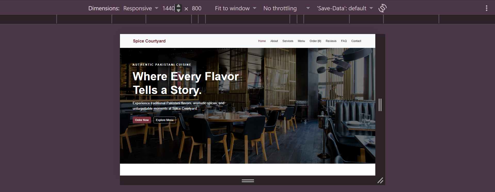

# Spice Courtyard — Responsive Restaurant Landing Page

A responsive restaurant landing page built to showcase Spice Courtyard's Pakistani cuisine, services, dining packages, menu, customer reviews, and contact information.

## Live Website

[View Spice Courtyard](https://kainat23fa.github.io/Spice-Courtyard/)

## About the Project

Spice Courtyard is a responsive business landing page created as part of **The Sky Gen Web Development — Project 02**.

The website represents a Pakistani restaurant concept designed to provide visitors with a clear and engaging way to explore the restaurant's menu, services, dining packages, customer testimonials, frequently asked questions, and contact information.

The website is built using HTML, CSS, JavaScript, and Bootstrap 5, with a focus on responsive design, user interaction, and a professional commercial layout.

## Features

* Responsive single-page restaurant landing page
* Sticky navigation with smooth scrolling
* Active navigation link highlighting
* Hero section with call-to-action buttons
* About section
* Services section with four service cards and icons
* Menu section featuring Pakistani dishes
* Interactive menu/order functionality
* Dining packages with a highlighted recommended plan
* Testimonials slider with navigation controls
* FAQ accordion with JavaScript
* Contact form with client-side validation
* Embedded Google Map
* Mobile hamburger navigation
* Hover effects and smooth transitions
* Responsive layout for different screen sizes

## Technologies Used

* HTML5 — Website structure and semantic elements
* CSS3 — Styling, layout, responsive design, and visual effects
* JavaScript — DOM manipulation, events, form validation, accordion, navigation, and menu/order functionality
* Bootstrap 5 — Responsive layout and UI components
* Bootstrap Icons — Icons used throughout the website
* Google Maps Embed — Restaurant location
* Unsplash — Hero background image
* Git — Version control
* GitHub — Source code repository
* GitHub Pages — Website deployment

## Responsive Design

The restaurant landing page is designed to work across different screen sizes, including:

* 360px — Mobile
* 768px — Tablet
* 1440px — Desktop

Media queries, Bootstrap's responsive grid system, and responsive CSS techniques are used to provide a consistent experience across devices.

## Project Structure

```text
Spice-Courtyard/
│
├── index.html
├── css/
│   └── style.css
├── js/
│   └── script.js
├── images/
│   ├── about.jpg
│   ├── biryani.jpg
│   ├── tikka.jpg
│   ├── karahi.jpg
│   └── gulabjamun.jpg
└── README.md
```

## How to Run Locally

1. Clone the repository:

```bash
git clone https://github.com/Kainat23FA/Spice-Courtyard.git
```

2. Open the project folder.

3. Open `index.html` in your browser.

No additional installation or dependencies are required.

## Screenshots

### Mobile — 360px



### Tablet — 768px



### Desktop — 1440px



## Author

Kainat Faisal

Computer Science student interested in web development, software engineering, and learning new technologies.

## Project Information

* **Program:** The Sky Gen — Web Development
* **Project:** Project 02 — Responsive Business Landing Page
* **Business:** Spice Courtyard
* **Assigned:** 22 September 2026
* **Deadline:** 12 October 2026

## Connect With Me

* GitHub: https://github.com/Kainat23FA
* LinkedIn: https://www.linkedin.com/in/kainatfaisal/

```

**One important point:** I used the same screenshot naming pattern as your old README, but **don't add the screenshot section yet unless those files actually exist**. We'll create the three final screenshots later, then make sure the filenames exactly match.

For now, paste this into your empty `README.md`, save it, and tell me **done**.
```
